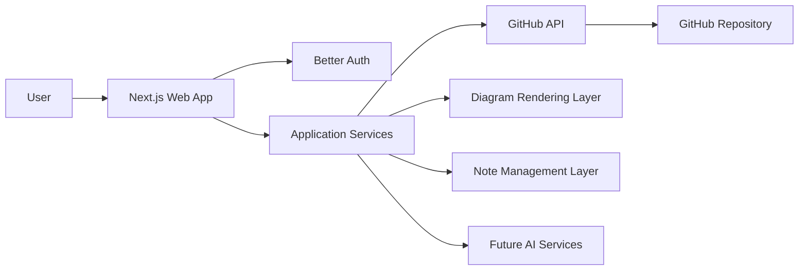

# Product Documentation

## Product Name
**Working name:** note-app

---

## 1. Product Introduction

note-app is a lightweight, GitHub-backed architecture workspace built for software architects, technical leads, and engineering teams who need a structured way to create, manage, and evolve technical documentation and diagrams.

The product combines three core capabilities in a single platform:

1. **Note management** for architecture documentation, ADRs, design notes, service definitions, API notes, and technical references.
2. **Diagram design** for creating and managing architecture diagrams, UML diagrams, flow diagrams, and system design visuals, both linked to notes and created independently.
3. **Future AI-assisted workflows** that can generate notes, produce diagrams, summarize systems, and help users evolve architecture documentation over time.

Unlike generic note-taking tools, note-app is designed specifically for software architecture work. It treats documentation and diagrams as first-class assets and uses GitHub as the source of truth so teams can keep their architecture knowledge versioned, portable, and aligned with engineering workflows.

---

## 2. Vision

To become the architecture workspace that helps engineers and architects design, document, and evolve complex software systems with clarity, structure, and traceability.

---

## 3. Product Goals

### Primary goals
- Provide a focused platform for architecture notes and diagrams.
- Use GitHub as the main data store and versioned source of truth.
- Offer a clean and simple UI with low setup complexity.
- Support both standalone diagrams and diagrams linked to notes.
- Establish a foundation for future AI capabilities.

### Secondary goals
- Reduce documentation sprawl across disconnected tools.
- Improve traceability between notes, diagrams, and repository history.
- Encourage structured documentation practices without becoming heavy or rigid.

---

## 4. Problem Statement

Software architects and engineering teams often split their work across multiple disconnected tools:
- Notes in one tool
- Diagrams in another tool
- Technical decisions in documents or chats
- Version history in Git

This creates several problems:
- Documentation becomes fragmented and difficult to maintain.
- Diagrams and notes drift apart.
- There is no lightweight, architecture-focused workspace that feels native to developer workflows.
- Generic note tools include many features that are unnecessary for architecture work.
- Diagram tools often lack version control and strong integration with documentation.

note-app addresses this by unifying notes and diagrams in a GitHub-backed workspace tailored for architecture documentation.

---

## 5. Target Users

### Primary users
- Software architects
- Solution architects
- Technical leads
- Senior software engineers
- Platform engineers

### Secondary users
- Engineering managers
- Product engineers involved in technical design
- Startup founders with technical oversight
- Teams documenting internal systems and architecture decisions

---

## 6. Actors

### 6.1 Workspace Owner
The primary owner of a workspace or connected GitHub repository.

**Responsibilities and capabilities:**
- Connect GitHub repositories
- Manage workspace content
- Create and edit notes
- Create and edit diagrams
- Organize documentation structure
- Review versioned changes through GitHub history
- Configure future AI capabilities

### 6.2 Contributor
A user who can work on notes and diagrams in connected repositories.

**Responsibilities and capabilities:**
- View documentation and diagrams
- Create or update notes
- Create or update diagrams
- Link diagrams to notes
- Use templates and structured content

### 6.3 Viewer
A read-only user who consumes architecture documentation.

**Responsibilities and capabilities:**
- Browse notes and diagrams
- View rendered content
- Search documentation
- Navigate note-to-diagram relationships

### 6.4 AI Assistant (future actor)
A system actor that assists users in producing or updating content.

**Future responsibilities and capabilities:**
- Generate architecture notes
- Suggest documentation structures
- Create initial diagrams from prompts
- Summarize repository architecture
- Update diagrams and notes based on requested changes

### 6.5 External Systems
- GitHub
- Better Auth provider stack
- Future AI model providers
- Optional external diagram rendering services

---

## 7. Product Scope

### In scope for the initial version
- Authentication and session management
- GitHub repository connection
- Repository-backed note management
- Diagram creation and editing
- Note-linked and standalone diagrams
- Basic workspace navigation
- Rendering of supported diagram types
- Clean architecture-focused user interface

### Out of scope for the initial version
- Real-time multi-user collaboration
- Full offline desktop support
- Branch and pull request management UI
- Marketplace or plugin ecosystem
- Large-scale enterprise administration
- AI generation in the first release

---

## 8. Core Product Concepts

### 8.1 Workspace
A workspace represents the user’s architecture documentation environment. It is logically associated with one or more connected GitHub repositories.

### 8.2 Repository
A GitHub repository acts as the source of truth for notes, diagrams, and related assets.

### 8.3 Note
A note is a structured document stored in the repository, typically in Markdown. Notes may include references to diagrams, links to other notes, and architecture metadata.

### 8.4 Diagram
A diagram is a design artifact that may exist independently or be associated with one or more notes.

### 8.5 Linkage
A relationship between notes and diagrams that allows users to navigate between textual documentation and visual design assets.

---

## 9. Functional Requirements

## 9.1 Authentication and Access

### FR-1 User authentication
The system shall allow users to sign in securely.

### FR-2 Better Auth integration
The system shall use Better Auth as the authentication framework.

### FR-3 Session handling
The system shall maintain authenticated sessions securely across the web application.

### FR-4 GitHub authorization
The system shall allow users to connect a GitHub account and authorize repository access.

### FR-5 Repository permission validation
The system shall validate whether the authenticated user has appropriate access to selected repositories.

---

## 9.2 Workspace and Repository Management

### FR-6 Repository connection
The system shall allow a user to connect one or more GitHub repositories to the workspace.

### FR-7 Repository browsing
The system shall display repository content relevant to documentation assets.

### FR-8 Structured content navigation
The system shall provide navigation for notes, diagrams, and folders.

### FR-9 Repository-based persistence
The system shall store notes and diagrams in the connected GitHub repository.

### FR-10 File retrieval
The system shall retrieve notes and diagrams from GitHub for display and editing.

### FR-11 Save changes
The system shall save updates to GitHub-backed files.

---

## 9.3 Note Management

### FR-12 Create note
The system shall allow users to create new notes.

### FR-13 Edit note
The system shall allow users to edit existing notes.

### FR-14 Delete note
The system shall allow users to delete notes, subject to permissions.

### FR-15 Render note content
The system shall render Markdown note content in a readable format.

### FR-16 Organize notes
The system shall allow notes to be organized into folders or structured paths.

### FR-17 Note linking
The system shall support links between notes.

### FR-18 Diagram embedding in notes
The system shall allow users to embed or reference diagrams inside notes.

### FR-19 Search notes
The system shall allow users to search notes by title, path, and content.

### FR-20 Templates for notes
The system shall support structured note templates such as architecture overview notes and ADRs.

---

## 9.4 Diagram Management

### FR-21 Create standalone diagram
The system shall allow users to create diagrams that are not attached to any specific note.

### FR-22 Create note-linked diagram
The system shall allow users to create diagrams associated with notes.

### FR-23 Edit diagram
The system shall allow users to edit existing diagrams.

### FR-24 Delete diagram
The system shall allow users to delete diagrams, subject to permissions.

### FR-25 Render diagrams
The system shall render supported diagram formats in the UI.

### FR-26 Diagram organization
The system shall organize diagrams independently from notes while preserving link relationships.

### FR-27 Diagram metadata
The system shall store metadata such as title, type, related note, and file path.

### FR-28 Support multiple diagram modes
The system shall support text-based diagrams initially and allow later support for visual diagram editing.

### FR-29 Preview diagram changes
The system shall provide a live or near-live preview for diagram edits where possible.

---

## 9.5 Relationship Management

### FR-30 Link notes to diagrams
The system shall allow users to associate notes with one or more diagrams.

### FR-31 Link diagrams to notes
The system shall allow users to navigate from a diagram back to its related note or notes.

### FR-32 Mixed navigation
The system shall support both note-first and diagram-first navigation paths.

### FR-33 Relationship display
The system shall display relationships between notes and diagrams in the UI.

---

## 9.6 User Interface and Experience

### FR-34 Workspace dashboard
The system shall provide a workspace home screen or dashboard.

### FR-35 File explorer
The system shall provide a file explorer or content navigator.

### FR-36 Editor surface
The system shall provide an editor for notes and diagrams.

### FR-37 Preview surface
The system shall provide preview capability for rendered notes and diagrams.

### FR-38 Split view
The system shall support side-by-side editing and preview where appropriate.

### FR-39 Responsive web experience
The system shall function across desktop and laptop screen sizes, with the interface optimized primarily for desktop use.

---

## 9.7 Versioning and History

### FR-40 GitHub-backed history
The system shall rely on GitHub for source-of-truth version history.

### FR-41 Commit on save strategy
The system shall save changes in a way compatible with GitHub commit-based storage.

### FR-42 File change visibility
The system shall make it clear to the user when content has unsaved or newly saved changes.

---

## 9.8 Future AI Capabilities

### FR-43 AI-generated notes
The platform shall later support generating notes from user prompts.

### FR-44 AI-generated diagrams
The platform shall later support generating diagrams from prompts or note content.

### FR-45 AI-assisted editing
The platform shall later support modifying notes and diagrams through AI assistance.

### FR-46 AI summarization
The platform shall later support summarizing architecture content.

### FR-47 AI context usage
The platform shall later use existing repository notes and diagrams as context for AI generation.

---

## 10. Non-Functional Requirements

## 10.1 Performance
- The application should load the main workspace quickly under normal repository sizes.
- File navigation should feel responsive.
- Rendering of standard notes and diagrams should complete within acceptable interactive time.
- Search should be optimized for a smooth user experience.

## 10.2 Scalability
- The application should support repositories of small to medium complexity in the initial version.
- The architecture should allow later expansion to larger repositories, multiple repositories, and AI-assisted workflows.

## 10.3 Reliability
- The application should handle GitHub API failures gracefully.
- The application should prevent accidental data loss during editing.
- Save operations should provide clear success and error feedback.

## 10.4 Security
- Authentication and session handling must be secure.
- Access tokens must be protected and never exposed unnecessarily to the client.
- Repository access should be limited to authorized scopes.
- Sensitive credentials must be stored securely.

## 10.5 Maintainability
- The codebase should be modular and structured for growth.
- The system should separate UI, domain logic, repository integration, and future AI services.
- Features should be added without excessive coupling.

## 10.6 Extensibility
- The architecture should allow later addition of AI features.
- The diagram subsystem should support multiple diagram formats over time.
- The data model should allow new content types and relationships.

## 10.7 Usability
- The UI should be simple, lightweight, and architecture-focused.
- Users should be able to understand the product structure quickly.
- Navigation between notes and diagrams should be intuitive.

## 10.8 Portability
- The system should work as a web application initially.
- The architecture should allow future packaging as a desktop application if needed.

## 10.9 Observability
- The platform should include logging and error tracking.
- Integration failures and save failures should be traceable.

---

## 11. Proposed Technology Stack

## 11.1 Frontend
- **Next.js** for the web application framework
- **React** for UI composition
- **TypeScript** for type safety
- **Tailwind CSS** for styling
- **shadcn/ui** for design system components

## 11.2 Authentication
- **Better Auth** for authentication and session management
- **GitHub OAuth** for repository access authorization

## 11.3 Data Store and Content Source of Truth
- **GitHub repositories** as the primary storage for notes, diagrams, and assets

## 11.4 State and Data Fetching
- **TanStack Query** for server-state management and API integration
- Optional local UI state through lightweight React state or a small state library if needed

## 11.5 Editors and Rendering
- Markdown editor for notes
- Diagram editing subsystem for supported diagram formats
- Markdown rendering pipeline for notes
- Mermaid rendering for text-based diagrams in early versions
- Additional support for PlantUML or similar diagram engines later

## 11.6 Backend and API Layer
- Next.js server routes or server actions for secure GitHub interactions
- Domain services for repository access, note handling, diagram handling, and future AI orchestration

## 11.7 Future AI Layer
- AI orchestration layer abstracted from the main application
- Provider-agnostic design so AI models can be changed later

## 11.8 ORM
- **Drizzle ORM** for database interactions
- **PostgreSQL** as the primary database

---

## 12. High-Level Architecture

## 12.1 Architecture Overview

note-app will follow a web-first architecture built around three main layers:

1. **Presentation layer** for user interaction
2. **Application layer** for authentication, business logic, and orchestration
3. **Integration and storage layer** for GitHub-based persistence

---

## 12.2 Logical Architecture



---

## 12.3 Layered View

### Presentation Layer
Responsible for:
- Workspace UI
- File navigation
- Note editor
- Diagram editor
- Preview panels
- Relationship views

### Application Layer
Responsible for:
- Authentication orchestration
- Authorization checks
- Workspace logic
- Note management logic
- Diagram management logic
- Repository synchronization logic
- Future AI orchestration

### Integration Layer
Responsible for:
- GitHub API communication
- Repository file reads and writes
- Metadata handling
- Future AI provider integration

---

## 12.4 Initial Deployment Model
- Web application hosted on a modern frontend platform
- Server-side logic running through Next.js backend capabilities
- External integration with GitHub OAuth and GitHub API

---

## 13. Content Model

## 13.1 Note
Possible attributes:
- id
- title
- slug or path
- content
- repository path
- created date
- updated date
- related diagram references
- type or template category

## 13.2 Diagram
Possible attributes:
- id
- title
- diagram type
- file path
- raw source or design payload
- rendered preview reference
- related note references
- created date
- updated date

## 13.3 Workspace
Possible attributes:
- id
- owner
- connected repositories
- preferences
- active repository

---

## 14. Initial Repository Structure Proposal

```text
/docs
  /notes
  /adr
  /architecture
/diagrams
  /mermaid
  /uml
  /c4
/assets
  /images
  /exports
```

This structure is only a starting convention and may evolve.

---

## 15. Initial User Flows

## 15.1 Create a note
1. User signs in.
2. User selects a connected repository.
3. User chooses to create a new note.
4. User enters note content.
5. User saves.
6. The system writes the file to GitHub.

## 15.2 Create a standalone diagram
1. User opens the diagram section.
2. User creates a new diagram.
3. User chooses a diagram type.
4. User edits the diagram.
5. User saves.
6. The system stores the diagram file in GitHub.

## 15.3 Create a note-linked diagram
1. User opens a note.
2. User chooses to attach or create a diagram.
3. User edits the diagram.
4. The note is updated with a reference to the diagram.
5. The diagram is saved in the repository.

---

## 16. Risks and Considerations

### GitHub API dependency
The product depends heavily on GitHub API availability, scopes, and rate limits.

### Repository structure variability
Users may want custom file structures. The product should balance opinionated defaults with flexibility.

### Diagram complexity
Visual diagram editing can become a large subsystem. The product should begin with a scoped diagram strategy.

### AI feature scope
AI features should be introduced carefully after the core note and diagram workflows are stable.

---

## 17. Product Roadmap Direction

### Phase 1
- Authentication
- GitHub repository connection
- Note management
- Basic diagram support
- Note and diagram linking

### Phase 2
- Better search and relationships
- Templates and document conventions
- Improved diagram workflows

### Phase 3
- AI-assisted note generation
- AI-assisted diagram generation
- AI-assisted updates and summaries

### Phase 4
- Deeper repository intelligence
- Architecture-aware suggestions
- Possible desktop packaging

---

## 18. Summary

note-app is a focused architecture workspace for software architects and engineering teams. It brings together note management and diagram design in a GitHub-backed web application built with Next.js, shadcn/ui, DrizzleORM and Better Auth. The initial version emphasizes simplicity, structure, and versioned documentation workflows. The long-term direction includes AI capabilities that can help generate and evolve both notes and diagrams.

